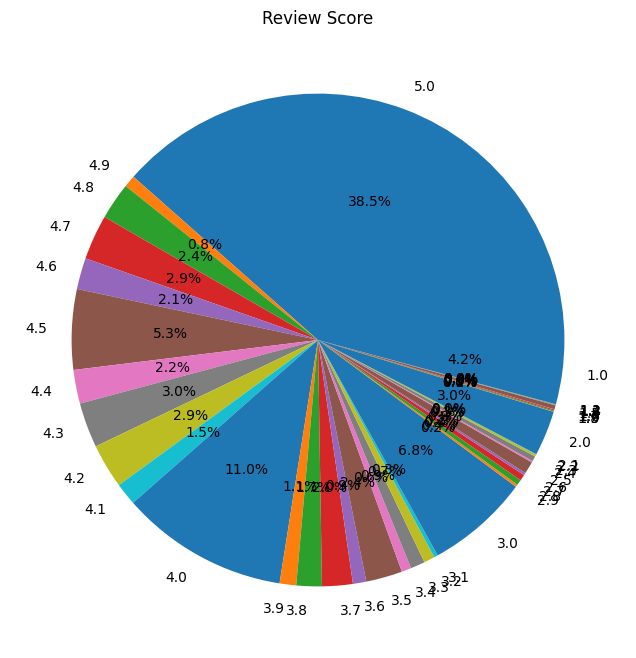
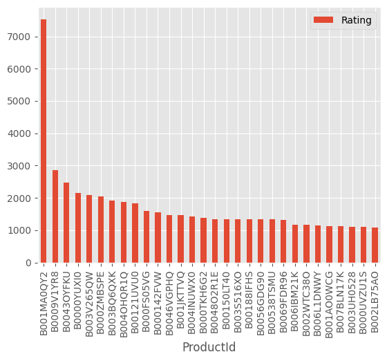

# Laporan Proyek Machine Learning - Prinanda Rahmatullah

## Domain Proyek
Amazon.com is one of the largest electronic commerce and cloud computing companies. Just a few Amazon related facts
They lost $4.8 million in August 2013, when their website went down for 40 mins. They hold the patent on 1-Click buying, and licenses it to Apple. Their Phoenix fulfilment centre is a massive 1.2 million square feet. Amazon relies heavily on a Recommendation engine that reviews customer ratings and purchase history to recommend items and improve sales.

## Business Understanding
### Problem Statements
- Bagaimana cara mengetahui jumlah user, produk, transaksi user, dan visualisasi review produk?
- Apa saja rekomendasi produk yang dihasilkan oleh pendekatan distance metrics yaitu cosine similarity dan machine learning berdasarkan produk id?

### Goals
Tujuan utamanya adalah : 
- Mengetahui jumlah user yang melakukan transaksi, produk, transaksi user, dan visualisasi review produk.
- Mendapatkan rekomendasi produk dari data penjualan produk kecantikan amazon berdasarkan produk id. 

### Solution Statement.
- Solusi untuk problem dan goals yang pertama adalah dengan pendekatan Exploratory Data Analysis
- Solusi untuk problem dan goals yang kedua adalah dengan menggunakan similarity distance dengan rumus kosinus serta menggunakan model SVD.

## Data Understanding
Sumber data : https://www.kaggle.com/datasets/skillsmuggler/amazon-ratings

Data penjualan produk kecantikan amazon terdiri atas 1 file yaitu ratings_Beauty.csv

### Variabel-variabel pada Data Mobile Price
Dataset yang terdiri lebih dari 2 juta review kustomer dan rating terhadap produk kecantikan Amazon.
Data terdiri atas:
1. UserId : Id customer
2. ProductId : Kode identifikasi produk Amazon 
3. Rating : Review rating dari user dari 1-5
4. Timestamp : Waktu terjadinya transaksi dalam UNIX


### DataFrame.describe()
Perintah ini menginformasikan data statistik dari masing-masing kolom numerik berupa jumlah baris, nilai rata-rata, nilai minimum & maksimum, kuartil, dan standar deviasi

### Null Data
Selanjutnya pada EDA adalah dalam mengecek data null atau kosong menggunakan command train_df.isna().sum() atau train_df.isnull().sum(). Hasilnya menunjukkan bahwa tidak ada data yang kosong pada dataset ini.

### Count Total User and Product
Total user adalah sebanyak 1210271 id user unik dan total produk adalah sebanyak 249274 id produk unik

### User Transaction Frequency
Di sini kita dapat mengetahui user mana yang paling banyak melakukan transaksi review atau pembelian produk kecantikan di Amazon. Dengan adanya data ini, pihak Amazon mungkin dapat memberikan bonus atau hadiah terhadap user tersebut. Berikut 10 user dengan transaksi terbanyak
| UserId  | Jumlah Transaksi  |
|---|---|
| A3KEZLJ59C1JVH |    389 |
| A281NPSIMI1C2R |    336 |
| A3M174IC0VXOS2 |    326 |
| A2V5R832QCSOMX |    278 |
| A3LJLRIZL38GG3 |    276 |
| ALQGOMOY1F5X9 |     275 |
| AKMEY1BSHSDG7 |     269 |
| A3R9H6OKZHHRJD |    259 |
| A1M04H40ZVGWVG |    249 |
| A1RRMZKOMZ2M7J |    225 |

### Produk Review
Pada bagian ini, kita dapat mengetahui rata-rata rating review setiap produk dan juga jumlah frekuensi masing-masing rating produk.


## Data Preparation

### Load Data
Load dataset dari file ratings_Beauty.csv ke dalam DataFrame. Di sini dataFrame sudah diload duluan pada tahap EDA.


## Modeling
Pendekatan yang diambil untuk mendapatkan hasil rekomendasi dari data produk kecantikan Amazon yaitu dengan menggunakan produk populer untuk user baru, rumus cosinus, dan pendekatan model SVD.

### Pendekatan Pertama : User Baru
User baru pastinya tidak memiliki rekam jejak historis transaksi. Oleh karena itu, kita dapat memberikan rekomendasi kepada mereka berupa produk yang paling populer yaitu produk yang paling banyak dibeli berdasarkan data transaksi penjualan produk kecantikan Amazon.<br>


<!-- TODO -->
### Pendekatan Kedua : Model Based Collaborative Filtering
Model ini akan merekomendasikan produk kepada user berdasarkan rekam historis transaksi dan kesamaan produk yang dibeli oleh kustomer lainnya. Mulanya data user dan produk dikonversi menjadi matrix utility atau sparse matrix.

#### Cosine Similarity
Matriks hasil konversi kemudian dihitung kemiripan masing-masing produk terhadap user menggunakan rumus kosinus berikut:
```python
Cos(x, y) = x . y / ||x|| * ||y||
```
Fungsi recommendation akan memproses skor distance similarity dengan mengembalikan list 10 rekomendasi terbaik.

### Model Truncated SVD
Model ini berfungsi sebagai dimensionality reduksi linier dengan metransformasi menjadi data singular singular value decomposition (SVD) disebut juga LSA. Estimator ini tidak menengahkan data sebelum menghitung nilai yang akan didekomposisi. Oleh karena itu, model ini dapat bekerja sebaik mungkin pada matriks sparse seperti yang digunakan pada kasus ini. Cara penggunakan model ini dapat dilihat pada laman Scikit-learn berikut https://scikit-learn.org/stable/modules/generated/sklearn.decomposition.TruncatedSVD.html serta jurnal berikut yang membahas dekomposisi matrix https://arxiv.org/abs/0909.4061.<br><br>
Fungsi recommendation akan memproses hasil dari model dengan mengembalikan list 10 rekomendasi terbaik.

## Evaluation
Metrics evaluasi yang digunakan pada kasus ini adalah Precision seperti yang diuraikan pada forum diskusi Dicoding.

### Penjelasan Metrics
- True positive (TP) adalah banyaknya kategori data aktual suatu kelas A yang benar diprediksi oleh model sebagai kelas A.
- True negative (TN) adalah banyaknya kategori data aktual suatu kelas A yang benar diprediksi oleh model sebagai bukan kelas A.
- False positive (FP) adalah banyaknya kategori data aktual bukan kelas A, tetapi diprediksi oleh model sebagai kelas A.
- False negative (FN) adalah banyaknya kategori data aktual kelas A, tetapi diprediksi oleh model sebagai bukan kelas A.
Keempat data di atas dapat diketahui dari confusion matrix. Namun pada kasus ini, Precision dipilih dengan tujuan untuk mengetahui seberapa baik hasil rekomendasi yang sesuai dengan konteks yang dicari. Berikut rumus precision:
- Precision : 
    ```python
    Precision = TP / (TP + FP)
    ```

### Tes Rekomendasi dari Kedua Model Collaborative Filtering
Di sini, kita coba temukan rekomendasi dari suatu produk yaitu 6117036094. Masing-masing model memberikan jawaban berbeda karena menggunakan cara yang berbeda. 
- Cosine Similarity : ['B000052YQ2', '9790771401', '9790771444', '9790771479', '9790771347', '9790771339', '9790771584', '9790771517', '9790771762', '9790771568']
- Model SVD : ['0733001998', '0762451459', '1304146537', '1304168522', '1304196070', '1304482596', '1304488608', '1304495396', '130451112X', '1304622428']

Dari ketiga pendekatan di atas, kita dapat mengetahui rekomendasi produk yang cocok untuk masing-masing kondisi yaitu produk populer untuk user yang baru join dan produk yang kiranya cocok diberikan ketika user membeli suatu produk
<br>
Tujuan pertama sudah diperoleh pada bagian EDA yaitu mengetahui jumlah user, produk, transaksi user, dan produk review. Kemudian, tujuan kedua yaitu mengembangkan model sederhana rekomendasi menggunakan pendekatan cosine similarity distance dan model Singular Value Decomposition. Kedua pendekatan ini cocok digunakan ketika ukuran sparse matrix tidak terlalu besar.

## Terima Kasih